```mermaid
flowchart TB
subgraph EXT["🌐 External Services & APIs"]
BACKEND_API["NestLancer Backend API"]
RAZORPAY_JS["Razorpay.js SDK"]
ANALYTICS["Google Analytics"]
end

    subgraph CORE["⚙️ Core Frontend Infrastructure"]
        subgraph APP_CONFIG["App Configuration"]
            ENV_CONFIG["Environment Config"]
            API_CONFIG["API Client Config"]
            ROUTE_CONFIG["Route Configuration"]
            THEME_CONFIG["Theme Configuration"]
        end

        subgraph STATE_MGMT["State Management (UI Only)"]
            AUTH_STORE["Auth Store (Token + UI State)"]
            USER_STORE["User Store (UI State)"]
            UI_STORE["UI Store (Notifications, Loading)"]
            CACHE_STORE["Cache Store (API Response Cache)"]
        end

        subgraph CLIENT_SERVICES["Client Services (No Business Logic)"]
            API_CLIENT["API Client (HTTP Only)"]
            WEBSOCKET_CLIENT["WebSocket Client (Real-time Updates)"]
            ROUTER_CLIENT["Router (Client-side Navigation)"]
            NOTIFICATION_MANAGER["Notification Manager (UI Display)"]
        end

        subgraph UI_FRAMEWORK["UI Framework & Components"]
            COMPONENT_LIB["Component Library"]
            LAYOUT_SYSTEM["Layout System"]
            FORM_SYSTEM["Form System (UI + Validation Display)"]
            TABLE_SYSTEM["Table System (Display Only)"]
            MODAL_SYSTEM["Modal System"]
            CHART_SYSTEM["Chart System (Display Backend Data)"]
            DATA_GRID["Data Grid System (Display Only)"]
        end
    end

    subgraph SHARED["📦 Shared UI Modules"]
        subgraph SHARED_COMPONENTS["Shared UI Components"]
            LOADING_STATES["Loading States"]
            ERROR_BOUNDARIES["Error Boundaries"]
            FORM_CONTROLS["Form Controls"]
            DATA_DISPLAY["Data Display Components"]
            NAVIGATION["Navigation Components"]
            ROLE_GUARDS["Role-Based UI Guards"]
        end

        subgraph SHARED_UTILS["Shared Utilities (UI Only)"]
            UI_VALIDATION["UI Validation Helpers"]
            FORMATTERS["Data Formatters (Display)"]
            CONSTANTS["App Constants"]
            UI_HELPERS["UI Utility Helpers"]
        end

        subgraph SHARED_HOOKS["Shared Hooks (React/Vue)"]
            AUTH_HOOKS["Auth Hooks (UI State)"]
            API_HOOKS["API Hooks (Data Fetching)"]
            UI_HOOKS["UI Hooks"]
            FORM_HOOKS["Form Hooks (UI State)"]
        end
    end

    subgraph USER_FEATURES["👤 User-Facing Features (UI Only)"]
        subgraph AUTH_MODULE["Authentication UI"]
            LOGIN_PAGE["Login Page"]
            REGISTER_PAGE["Register Page"]
            FORGOT_PASSWORD["Forgot Password Form"]
            RESET_PASSWORD["Reset Password Form"]
            EMAIL_VERIFY["Email Verification Page"]
        end

        subgraph USER_DASHBOARD["User Dashboard UI"]
            USER_OVERVIEW["User Overview Display"]
            USER_ACTIVITY["User Activity Display"]
            USER_STATS["User Statistics Display"]
        end

        subgraph USER_PROFILE["User Profile Management UI"]
            PROFILE_PAGE["Profile View Page"]
            PROFILE_EDIT["Profile Edit Form"]
            AVATAR_UPLOAD["Avatar Upload Component"]
            SETTINGS_PAGE["Settings Page"]
        end

        subgraph PROJECT_MODULE["Projects Display"]
            PROJECT_LIST["Project List View"]
            PROJECT_DETAIL["Project Detail View"]
            PROJECT_GALLERY["Project Gallery"]
            PROJECT_SEARCH["Project Search UI"]
        end

        subgraph REQUEST_MODULE["Requests UI"]
            REQUEST_CREATE["Request Create Form"]
            REQUEST_LIST["Request List View"]
            REQUEST_DETAIL["Request Detail View"]
            REQUEST_TRACKING["Request Tracking Display"]
        end

        subgraph QUOTE_MODULE["Quotes UI"]
            QUOTE_LIST["Quote List View"]
            QUOTE_DETAIL["Quote Detail View"]
            QUOTE_ACCEPT["Quote Acceptance Form"]
        end

        subgraph PAYMENT_MODULE["Payments UI"]
            PAYMENT_FORM["Payment Form (Razorpay UI)"]
            PAYMENT_METHODS["Payment Methods Display"]
            PAYMENT_HISTORY["Payment History View"]
            PAYMENT_RECEIPTS["Payment Receipts Display"]
        end

        subgraph PROGRESS_MODULE["Progress Display"]
            PROGRESS_TIMELINE["Progress Timeline View"]
            MILESTONE_TRACKING["Milestone Tracking Display"]
        end

        subgraph PORTFOLIO_MODULE["Portfolio Display"]
            PORTFOLIO_VIEW["Portfolio View"]
            FEATURED_PROJECTS["Featured Projects Display"]
            PORTFOLIO_STATS["Portfolio Statistics Display"]
            TECHNOLOGY_STACK["Technology Stack Display"]
        end

        subgraph MEDIA_MODULE["Media UI"]
            MEDIA_UPLOAD["Media Upload Component"]
            MEDIA_GALLERY["Media Gallery Display"]
            MEDIA_BROWSER["Media Browser"]
        end

        subgraph MESSAGING_MODULE["Messaging UI (Role-Restricted)"]
            CHAT_INTERFACE["Chat Interface"]
            CONVERSATION_LIST["Conversation List Display"]
            MESSAGE_COMPOSER["Message Composer Form"]
            TYPING_INDICATOR["Typing Indicator (WebSocket)"]
            MESSAGE_THREAD["Message Thread View"]
            UNREAD_BADGES["Unread Badges (Display Backend Count)"]
        end

        subgraph NOTIFICATION_MODULE["Notifications UI"]
            NOTIFICATION_CENTER["Notification Center Display"]
            NOTIFICATION_BELL["Notification Bell (Display Count)"]
            NOTIFICATION_ITEMS["Notification Items Display"]
        end

        subgraph BLOG_MODULE["Blog UI"]
            BLOG_LIST["Blog List View"]
            BLOG_POST["Blog Post View"]
            BLOG_COMMENTS["Blog Comments Display"]
        end

        subgraph CONTACT_MODULE["Contact UI"]
            CONTACT_FORM["Contact Form"]
        end
    end

    subgraph ADMIN_FEATURES["👨‍💼 Admin UI (Display Backend Data Only)"]
        subgraph ADMIN_DASHBOARD["Admin Dashboard UI"]
            ADMIN_OVERVIEW["Admin Overview (Display Backend Analytics)"]
            SYSTEM_METRICS["System Metrics Display"]
            REAL_TIME_STATS["Real-time Statistics Display"]
            HEALTH_MONITORING["Health Monitoring Display"]
        end

        subgraph ADMIN_ANALYTICS["Admin Analytics UI"]
            USER_ANALYTICS["User Analytics Display"]
            REQUEST_ANALYTICS["Request Analytics Display"]
            PAYMENT_ANALYTICS["Payment Analytics Display"]
            QUOTE_ANALYTICS["Quote Analytics Display"]
            RATE_LIMIT_ANALYTICS["Rate Limit Analytics Display"]
        end

        subgraph ADMIN_USER_MGMT["User Management UI"]
            USER_LIST["User List Display"]
            USER_DETAILS["User Details View"]
            USER_EDIT["User Edit Form"]
            USER_STATUS["User Status Management Form"]
            BULK_USER_ACTIONS["Bulk User Actions Form"]
        end

        subgraph ADMIN_PROJECT_MGMT["Project Management UI"]
            PROJECT_CREATE["Project Create Form"]
            PROJECT_EDIT["Project Edit Form"]
            PROJECT_DELETE["Project Delete Confirmation"]
            PROJECT_RESTORE["Project Restore Form"]
            BULK_PROJECT_ACTIONS["Bulk Project Actions Form"]
            PROJECT_TECH_STACK["Project Tech Stack Management Form"]
            PROJECT_TESTIMONIALS["Project Testimonials Management Form"]
        end

        subgraph ADMIN_REQUEST_MGMT["Request Management UI"]
            REQUEST_LIST_ADMIN["Request List Display - Admin"]
            REQUEST_DETAIL_ADMIN["Request Detail View - Admin"]
            REQUEST_STATUS["Request Status Management Form"]
            BULK_REQUEST_ACTIONS["Bulk Request Actions Form"]
        end

        subgraph ADMIN_QUOTE_MGMT["Quote Management UI"]
            QUOTE_LIST_ADMIN["Quote List Display - Admin"]
            QUOTE_DETAIL_ADMIN["Quote Detail View - Admin"]
            QUOTE_STATUS["Quote Status Management Form"]
            BULK_QUOTE_ACTIONS["Bulk Quote Actions Form"]
        end

        subgraph ADMIN_PAYMENT_MGMT["Payment Management UI"]
            PAYMENT_LIST_ADMIN["Payment List Display"]
            PAYMENT_DETAILS_ADMIN["Payment Details View"]
            REFUND_MANAGEMENT["Refund Management Form"]
            PAYMENT_ANALYTICS_ADMIN["Payment Analytics Display"]
        end

        subgraph ADMIN_PROGRESS_MGMT["Progress Management UI"]
            PROGRESS_UPDATES["Progress Updates Form"]
            MILESTONE_MANAGEMENT["Milestone Management Form"]
            PROGRESS_ANALYTICS["Progress Analytics Display"]
        end

        subgraph ADMIN_MEDIA_MGMT["Media Management UI"]
            MEDIA_LIST_ADMIN["Media List Display"]
            MEDIA_DETAILS_ADMIN["Media Details View"]
            MEDIA_VISIBILITY["Media Visibility Management Form"]
            BULK_MEDIA_ACTIONS["Bulk Media Actions Form"]
            STORAGE_ADMIN["Storage Administration Display"]
        end

        subgraph ADMIN_BLOG_MGMT["Blog Management UI"]
            BLOG_CREATE_ADMIN["Blog Create Form"]
            BLOG_EDIT_ADMIN["Blog Edit Form"]
            BLOG_DELETE_ADMIN["Blog Delete Confirmation"]
            BLOG_COMMENTS_ADMIN["Blog Comments Management Display"]
        end

        subgraph ADMIN_CONTACT_MGMT["Contact Management UI"]
            CONTACT_MESSAGES["Contact Messages Display"]
            MESSAGE_INBOX["Message Inbox Display"]
            MESSAGE_STATUS["Message Status Management Form"]
            CONTACT_ANALYTICS["Contact Analytics Display"]
        end

        subgraph ADMIN_SYSTEM["System Administration UI"]
            SYSTEM_CONFIG["System Configuration Form"]
            API_KEY_MGMT["API Key Management UI"]
            SYSTEM_INFO["System Information Display"]
            SYSTEM_HEALTH_DISPLAY["System Health Display"]
            ENVIRONMENT_CONFIG["Environment Configuration Form"]
            SYSTEM_METRICS_DISPLAY["System Metrics Display"]
            PERFORMANCE_MONITORING["Performance Monitoring Display"]
        end

        subgraph ADMIN_AUDIT["Audit & Monitoring UI"]
            AUDIT_LOGS["Audit Logs Display"]
            AUDIT_FILTERS["Audit Filters Form"]
            AUDIT_EXPORT["Audit Export Form"]
            AUDIT_ANALYTICS["Audit Analytics Display"]
        end

        subgraph ADMIN_WEBHOOKS["Webhook Management UI"]
            WEBHOOK_LOGS["Webhook Logs Display"]
            WEBHOOK_CONFIG["Webhook Configuration Form"]
            WEBHOOK_MONITORING["Webhook Monitoring Display"]
            WEBHOOK_RETRY["Webhook Retry Management Form"]
            WEBHOOK_STATS["Webhook Statistics Display"]
        end

        subgraph ADMIN_STORAGE["Storage Administration UI"]
            STORAGE_OVERVIEW["Storage Overview Display"]
            STORAGE_ANALYTICS["Storage Analytics Display"]
            STORAGE_CLEANUP["Storage Cleanup Tools Form"]
            STORAGE_MIGRATION["Storage Migration Form"]
            STORAGE_BACKUP["Storage Backup Management Display"]
        end
    end

    subgraph LAYOUT["🎨 Layout Structure"]
        subgraph APP_LAYOUT["App Layout"]
            NAVBAR["Navigation Bar"]
            SIDEBAR["Sidebar Menu"]
            FOOTER["Footer"]
            BREADCRUMBS["Breadcrumbs"]
        end

        subgraph AUTH_LAYOUT["Auth Layout"]
            AUTH_FORMS["Auth Forms Container"]
            AUTH_HEADER["Auth Header"]
        end

        subgraph USER_LAYOUT["User Layout"]
            USER_HEADER["User Header"]
            USER_SIDEBAR["User Sidebar"]
            USER_CONTENT["User Content Area"]
        end

        subgraph ADMIN_LAYOUT["Admin Layout"]
            ADMIN_HEADER["Admin Header"]
            ADMIN_SIDEBAR["Admin Sidebar"]
            ADMIN_CONTENT["Admin Content Area"]
            ADMIN_NAVIGATION["Admin Navigation"]
        end
    end

    %% External Connections (API Calls Only)
    API_CLIENT --> BACKEND_API
    WEBSOCKET_CLIENT --> BACKEND_API
    PAYMENT_FORM --> RAZORPAY_JS
    NOTIFICATION_MANAGER --> ANALYTICS

    %% Core Infrastructure Connections (Client-Side Only)
    APP_CONFIG --> API_CLIENT & ROUTER_CLIENT
    STATE_MGMT --> API_CLIENT & WEBSOCKET_CLIENT
    UI_FRAMEWORK --> COMPONENT_LIB & LAYOUT_SYSTEM & CHART_SYSTEM & DATA_GRID
    ROUTER_CLIENT --> NOTIFICATION_MANAGER
    AUTH_STORE --> ROLE_GUARDS

    %% Shared Modules Connections (UI Only)
    SHARED_COMPONENTS --> USER_FEATURES & ADMIN_FEATURES
    SHARED_UTILS --> USER_FEATURES & ADMIN_FEATURES
    SHARED_HOOKS --> USER_FEATURES & ADMIN_FEATURES
    ROLE_GUARDS --> ADMIN_FEATURES

    %% User Features Connections (API Client Only)
    AUTH_MODULE --> API_CLIENT & ROUTER_CLIENT & AUTH_STORE
    USER_DASHBOARD --> API_CLIENT & AUTH_STORE & USER_STORE
    USER_PROFILE --> API_CLIENT & AUTH_STORE
    PROJECT_MODULE --> API_CLIENT & USER_STORE
    REQUEST_MODULE --> API_CLIENT & USER_STORE
    QUOTE_MODULE --> API_CLIENT & PAYMENT_MODULE
    PAYMENT_MODULE --> API_CLIENT & RAZORPAY_JS
    PROGRESS_MODULE --> API_CLIENT & WEBSOCKET_CLIENT
    PORTFOLIO_MODULE --> API_CLIENT
    MEDIA_MODULE --> API_CLIENT
    MESSAGING_MODULE --> API_CLIENT & WEBSOCKET_CLIENT & USER_STORE
    NOTIFICATION_MODULE --> API_CLIENT & WEBSOCKET_CLIENT & UI_STORE
    BLOG_MODULE --> API_CLIENT & USER_STORE
    CONTACT_MODULE --> API_CLIENT

    %% Admin Features Connections (Display Backend Data Only)
    ADMIN_DASHBOARD --> API_CLIENT & AUTH_STORE
    ADMIN_ANALYTICS --> API_CLIENT & CHART_SYSTEM & DATA_GRID
    ADMIN_USER_MGMT --> API_CLIENT & USER_STORE
    ADMIN_PROJECT_MGMT --> API_CLIENT
    ADMIN_REQUEST_MGMT --> API_CLIENT
    ADMIN_QUOTE_MGMT --> API_CLIENT
    ADMIN_PAYMENT_MGMT --> API_CLIENT
    ADMIN_PROGRESS_MGMT --> API_CLIENT & WEBSOCKET_CLIENT
    ADMIN_MEDIA_MGMT --> API_CLIENT
    ADMIN_BLOG_MGMT --> API_CLIENT
    ADMIN_CONTACT_MGMT --> API_CLIENT
    ADMIN_SYSTEM --> API_CLIENT
    ADMIN_AUDIT --> API_CLIENT & DATA_GRID
    ADMIN_WEBHOOKS --> API_CLIENT & WEBSOCKET_CLIENT
    ADMIN_STORAGE --> API_CLIENT

    %% Layout Connections
    APP_LAYOUT --> USER_FEATURES & ADMIN_FEATURES
    AUTH_LAYOUT --> AUTH_MODULE
    USER_LAYOUT --> USER_FEATURES
    ADMIN_LAYOUT --> ADMIN_FEATURES

    %% Styling
    classDef core fill:#E3F2FD,stroke:#1E88E5,color:#0D47A1,font-weight:bold
    classDef ext fill:#FCE4EC,stroke:#C2185B,color:#880E4F
    classDef user fill:#E8F5E8,stroke:#2E7D32,color:#1B5E20
    classDef admin fill:#FFF3E0,stroke:#FB8C00,color:#E65100
    classDef shared fill:#F3E5F5,stroke:#8E24AA,color:#4A148C
    classDef layout fill:#E1F5FE,stroke:#0277BD,color:#01579B
    classDef config fill:#FFF8E1,stroke:#FFA000,color:#E65100

    class CORE core
    class EXT ext
    class USER_FEATURES user
    class ADMIN_FEATURES admin
    class SHARED shared
    class LAYOUT layout
    class APP_CONFIG config
```

---

## ✅ CORRECTED Architecture Principles

### 🎯 Core Philosophy: Frontend = UI Only

**The frontend's ONLY responsibility is USER INTERFACE. All business logic, data processing, validation, and security is handled by the backend.**

### 🔧 Corrected Core Services

#### ✅ What Frontend SHOULD Have:
```typescript
// ✅ API Client - HTTP requests only
class ApiClient {
  get(endpoint: string): Promise<Response>
  post(endpoint: string, data: any): Promise<Response>
  // No business logic, just HTTP
}

// ✅ Auth Store - UI state only  
class AuthStore {
  token: string | null
  user: User | null
  isAuthenticated: boolean
  // No validation, just state management
}

// ✅ WebSocket Client - Real-time updates only
class WebSocketClient {
  connect(): void
  disconnect(): void
  onMessage(callback: Function): void
  // No message processing, just connection
}
```

#### ❌ What Frontend SHOULD NOT Have:
```typescript
// ❌ REMOVED - Backend handles all auth logic
class AuthService {
  validateToken() // Backend validates
  hashPassword() // Backend hashes  
  checkPermissions() // Backend RBAC
}

// ❌ REMOVED - Backend handles all storage
class StorageService {
  uploadFile() // Backend handles uploads
  validateFile() // Backend validates
  processFile() // Backend processes
}

// ❌ REMOVED - Backend provides analytics
class AnalyticsService {
  calculateMetrics() // Backend calculates
  processData() // Backend processes
  generateReports() // Backend generates
}
```

### 🔄 Data Flow Strategy

#### ✅ CORRECT Data Flow:
```
User Action → Form Submission → API Call → Backend Processing → API Response → UI Update
```

#### ❌ INCORRECT Data Flow:
```
User Action → Frontend Processing → Frontend Validation → API Call → More Frontend Logic
```

### 🛡️ Security & Validation Strategy

#### ✅ Frontend Security (UI Only):
- Display authentication status from backend
- Show/hide UI elements based on user roles from backend
- Form input validation for user experience only
- Route guards based on authentication status
- Display error messages from backend

#### ❌ Frontend Should NOT Handle:
- Token validation (backend validates)
- Password hashing (backend handles)  
- Permission calculations (backend RBAC)
- Rate limiting (backend enforces)
- Data sanitization (backend sanitizes)
- Business rule validation (backend validates)

### 📱 Messaging Module Corrections

#### Backend Messaging Rules:
- Users can ONLY message administrators
- Users CANNOT message other regular users  
- Backend enforces all conversation restrictions

#### ✅ Corrected Frontend Messaging:
```typescript
// ✅ UI components only
const MessageComposer = ({ conversationId }) => {
  // Form submission only - backend handles validation
  const sendMessage = (content) => {
    apiClient.post(`/conversations/${conversationId}/messages`, { content })
  }
}

const ConversationList = () => {
  // Display backend data only
  const conversations = useApi('/conversations')
  return conversations.map(renderConversation)
}
```

### 🔧 Admin Module Corrections

#### ✅ Admin Components (Display Only):
- Admin Dashboard: Display backend analytics data
- User Management: Forms that call backend APIs
- System Configuration: Forms that update backend settings
- Analytics: Charts displaying backend-calculated data

#### ❌ Admin Components Should NOT:
- Calculate analytics (backend provides)
- Validate admin actions (backend validates)
- Process system configurations (backend processes)
- Generate reports (backend generates)

### 🚀 Implementation Guidelines

#### Phase 1: Remove Business Logic
1. **Delete** all business logic services
2. **Keep** only UI state management
3. **Replace** service calls with direct API calls
4. **Remove** frontend validation logic

#### Phase 2: Simplify Components  
1. **Update** components to display backend data only
2. **Remove** data processing from components
3. **Add** loading states for API calls
4. **Handle** API errors with error boundaries

#### Phase 3: WebSocket Integration
1. **Use** WebSocket for real-time UI updates only
2. **No** WebSocket message processing logic
3. **Display** real-time data from WebSocket events
4. **Update** UI state when receiving WebSocket messages

#### Phase 4: Role-Based UI
1. **Display/hide** components based on user role from backend
2. **No** role calculation in frontend
3. **Use** user context from authentication
4. **Route guards** based on authentication status only

### 📊 API Integration Patterns

#### ✅ Recommended Patterns:
```typescript
// ✅ Simple API hook
const useProjects = () => {
  const [projects, setProjects] = useState([])
  const [loading, setLoading] = useState(true)
  
  useEffect(() => {
    apiClient.get('/projects')
      .then(setProjects)
      .finally(() => setLoading(false))
  }, [])
  
  return { projects, loading }
}

// ✅ Form submission
const ProjectForm = ({ onSubmit }) => {
  const handleSubmit = (formData) => {
    apiClient.post('/projects', formData)
      .then(onSubmit)
      .catch(handleError) // Display backend errors
  }
}
```

#### ❌ Avoid These Patterns:
```typescript
// ❌ Business logic in frontend
const ProjectForm = ({ onSubmit }) => {
  const handleSubmit = (formData) => {
    // ❌ Don't validate business rules
    if (!validateProjectRules(formData)) return
    
    // ❌ Don't process data
    const processedData = processProjectData(formData)
    
    // ❌ Don't calculate values
    const calculatedPrice = calculateProjectPrice(processedData)
  }
}
```

---

## 🎯 Summary of Key Changes

### ✅ What Was CORRECTED:
1. **Removed** all business logic services (Auth, Storage, Analytics, etc.)
2. **Simplified** core services to UI-only functionality  
3. **Updated** messaging module to reflect backend role restrictions
4. **Corrected** admin components to display-only
5. **Removed** frontend validation and processing logic
6. **Added** proper separation between UI and business logic

### 🚀 Benefits of Corrected Architecture:
1. **No code duplication** between frontend and backend
2. **Single source of truth** for business logic (backend)
3. **Consistent validation** and processing (backend only)
4. **Better security** (no sensitive logic in frontend)
5. **Easier maintenance** (changes only needed in backend)
6. **Faster development** (frontend focuses on UI only)

### 📋 Implementation Checklist:
- [ ] Remove business logic services
- [ ] Update components to API-only data fetching
- [ ] Implement proper error boundaries  
- [ ] Add loading states for all API calls
- [ ] Set up WebSocket for real-time updates
- [ ] Implement role-based UI rendering
- [ ] Remove frontend validation logic
- [ ] Test API integration thoroughly

**This corrected architecture ensures the frontend is purely a presentation layer that consumes backend APIs, avoiding all code duplication and maintaining proper separation of concerns.**
